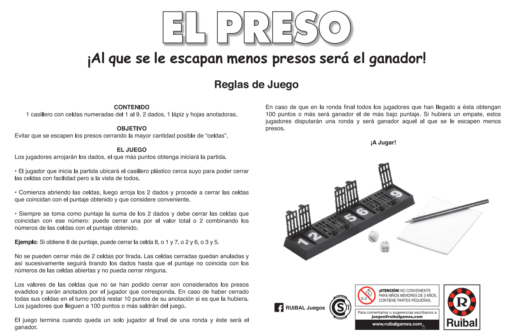

# El Preso - ¡Al que se le escapan menos presos será el ganador!

## Equipo de desarrollo

- Alguien
- Persona
- etc.

## Capturas

## Reglas de Juego / Instrucciones

OBJETIVO

    · Evitar que se escapen los presos cerrando la mayor cantidad posible de "celdas".

EL JUEGO

    Los jugadores arrojarán los dados, el que más puntos obtenga iniciará la partida.  # (definir si esto se va a hacer así o por orden)

        #· El jugador que inicia la partida ubicará el casillero plástico cerca suyo para poder cerrar
        #las celdas con facilidad pero a la vista de todos.          

        . Se arrojan los 2 dados *[D]* y procede a cerrar las celdas
        que coincidan con el puntaje obtenido y que considere conveniente.

        . Siempre se toma como puntaje la suma de los 2 dados y debe cerrar las celdas que
        coincidan con ese numero: puede cerrar una por el valor total o 2 combinando los
        números de las celdas con el puntaje obtenido.

EJEMPLO:

    · Si obtiene 8 de puntaje, puede cerrar la celda 8, o 1 y 7, o 2 y 6, o 3 y 5.

    · No se pueden cerrar más de 2 celdas por tirada. Las celdas cerradas quedan anuladas y
    así sucesivamente seguirá tirando los dados hasta que el puntaje no coincida con los
    numeros de las celdas abiertas y no pueda cerrar ninguna.

    · Los valores de las celdas que no se han podido cerrar son considerados los presos
    evadidos y serán anotados por el jugador que corresponda. En caso de haber cerrado
    todas sus celdas en el turno podrá restar 10 puntos de su anotación si es que la hubiera.
    Los jugadores que lleguen a 100 puntos o más saldrán del juego.

    · El juego termina cuando queda un solo jugador al final de una ronda y éste será el
    ganador.

    En caso de que en la ronda final todos los jugadores que han llegado a ésta obtengan
    100 puntos o más será ganador el de más bajo puntaje. Si hubiera un empate, estos
    jugadores disputarán una ronda y será ganador aquel al que se le escapen menos
    presos.

INSTRUCCIONES:
    

## Otros

- Curso/Facultad
- Versión de wollok
- Una vez terminado, no tenemos problemas en que el repositorio sea público / queremos manternerlo privado

## Anotaciones (borrar antes de entregar - no es parte del tp en sí)
## Cosas a resolver (para primer entrega)
    - Agregar el segundo dado.
    - Corregir logica del dado para saber que número es el que salio
    - Sumar y guardar los dados que salieron para poder compararlos.
    - Crear un turno, por cada turno el jugador puede seleccionar hasta
        2 casilleros.
    - Una vez lanzados los dados, no se pueden volver a lanzar 
    - Al presionar la tecla [P] (por ejemplo), se confirma si la seleccion
        del jugador corresponde a la suma de los dados. En caso de que esto
        sea así, se muestra en pantalla y se continúa el siguiente turno.
    - Ver como mostrar los puntajes de cada jugador. -importante-
    

    Cosas a futuro:
        - Crear los otros jugadores.
        - Crear sistema de turnos entre jugadores, no solo los turnos entre 
            tiradas de dados.
        - Crear menú de seleccion de:
            * Cantidad de jugadores.
            * Puntaje máximo para perder.

